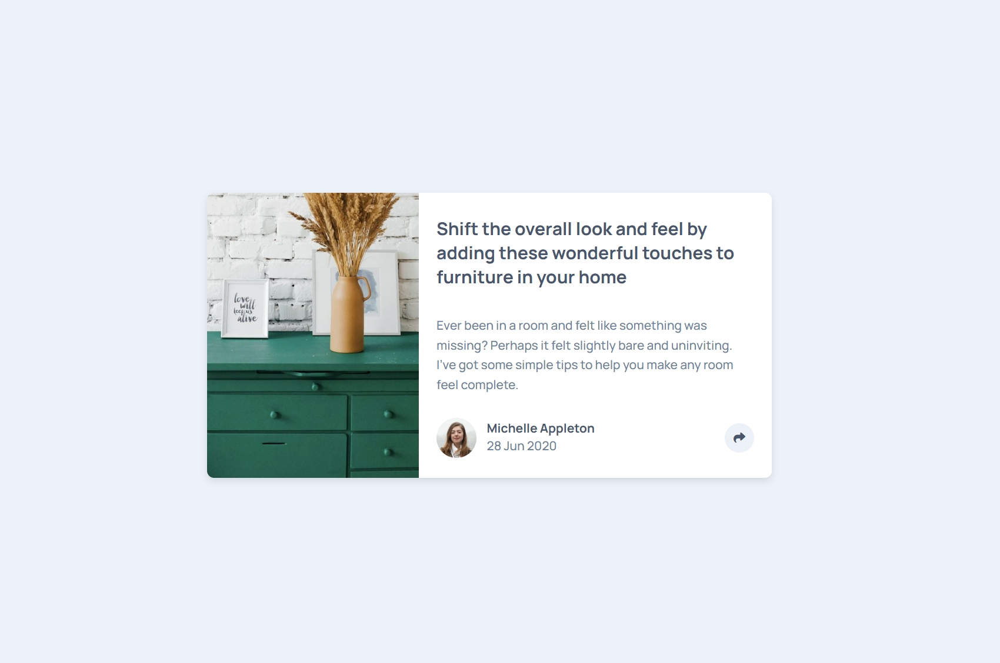

# Frontend Mentor - Article preview component solution

This is a solution to the [Article preview component challenge on Frontend Mentor](https://www.frontendmentor.io/challenges/article-preview-component-dYBN_pYFT). Frontend Mentor challenges help you improve your coding skills by building realistic projects.

## Table of contents

-  [Overview](#overview)
   -  [The challenge](#the-challenge)
   -  [Screenshot](#screenshot)
   -  [Links](#links)
-  [My process](#my-process)
   -  [Built with](#built-with)
   -  [What I learned](#what-i-learned)
   -  [Continued development](#continued-development)
   -  [Useful resources](#useful-resources)
-  [Author](#author)

**Note: Delete this note and update the table of contents based on what sections you keep.**

## Overview

### The challenge

Users should be able to:

-  View the optimal layout for the component depending on their device's screen size
-  Toggle and see the social media share options when clicking the share icon
-  Experience smooth animations when interacting with UI elements

### Screenshot



### Links

-  Solution URL: [](https://your-solution-url.com](https://github.com/AjoyChakravarthy/Article-preview-component)
-  Live Site URL: [](https://your-live-site-url.com](https://article-preview-component-chi-three.vercel.app/)

## My process

### Built with

-  Semantic HTML5 markup
-  Sass (SCSS)
-  Flexbox
-  CSS Grid
-  Vanilla JavaScript

### What I learned

-  How to structure a responsive layout using Flexbox.
-  Creating toggle functionality using vanilla JavaScript.
-  How to position pseudo-elements (::before) to create arrow indicators.
-  Using Sass for better maintainability and modular CSS

```css
.share-options::before {
   content: "";
   position: absolute;
   bottom: -10px;
   left: 50%;
   transform: translateX(-50%);
   border-left: 10px solid transparent;
   border-right: 10px solid transparent;
   border-top: 10px solid $text-dark;
}
```

### Continued development

-  Improve accessibility (ARIA roles and keyboard navigation).
-  Refactor JavaScript for better scalability.
-  Experiment with CSS animations for smoother transitions.

### Useful resources

-  [MDN Web Docs - Pseudo Elements](https://developer.mozilla.org/en-US/docs/Web/CSS/::before)
-  [CSS Tricks - Sass Guide](https://css-tricks.com/sass-style-guide/)

## Author

-  Website - [Ajoy chakravarthy](https://www.linkedin.com/in/ajoy-chakravarthy/)
-  Frontend Mentor - [@AjoyChakravarthy](https://www.frontendmentor.io/profile/AjoyChakravarthy)
